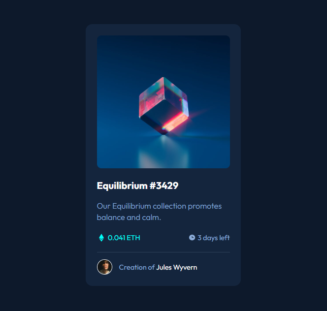

# Projeto Cartão de Visualização

Esse foi meu segundo projeto, um cartão de visualização do FrontEnd Mentor, um grande desafio pra quem esta começando, e esse desafio me ajudou muito a me testar e melhorar a minha capacidade de codar!

## Imagem final do projeto

### Tecnologias utilizadas

